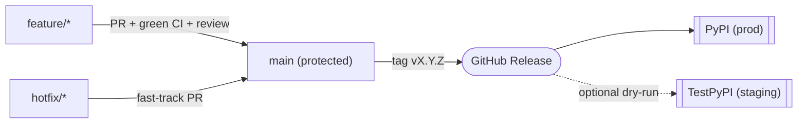
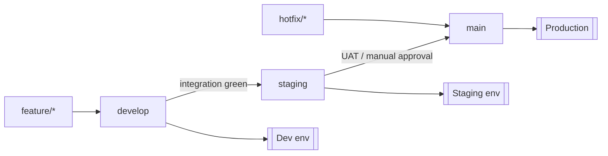
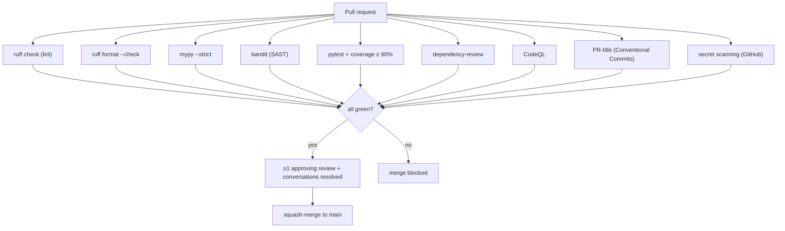
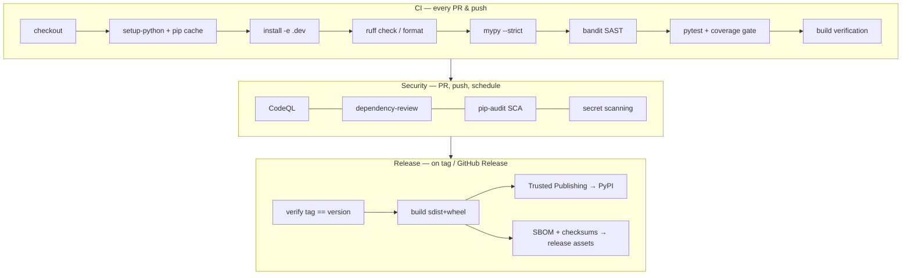
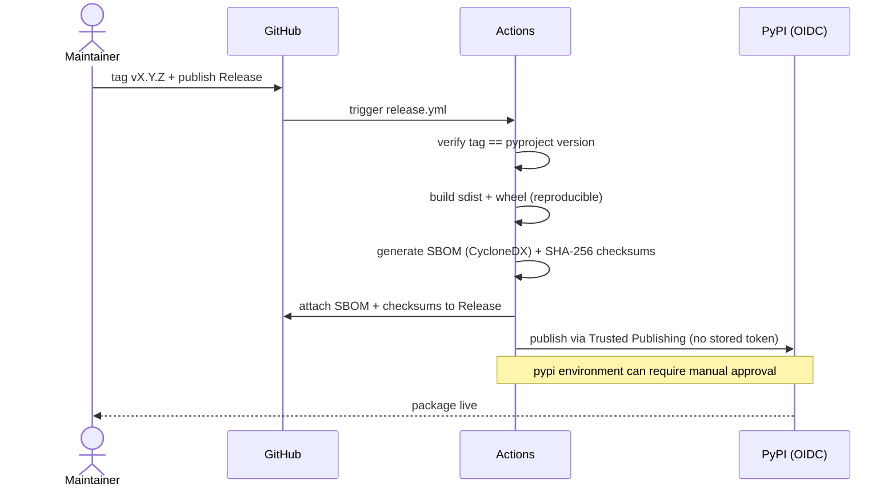
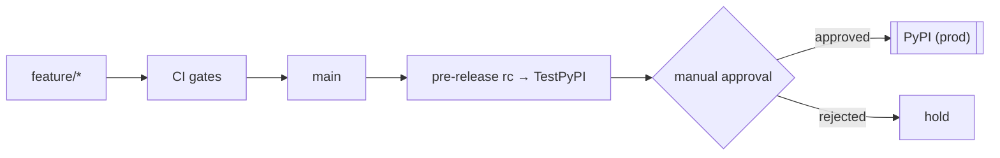

# DevSecOps: Git Workflow, CI/CD & Supply-Chain Architecture

This document is the source of truth for how code moves from a developer's
machine to a published release, and how we keep that path secure, reproducible,
and auditable.

> **Right-sizing note.** This repository is today a single, pre-1.0, Python CLI
> published to PyPI. The model below is **trunk-based with protected `main` and
> release tags** — what mature orgs actually run for a repo this size — and it
> documents the heavier GitFlow / multi-environment topology as the *future*
> path to switch on when a second service or environment exists. We add
> ceremony when it buys safety, not before. Every phase is additive and is
> designed to land **without disrupting ongoing development** (see
> [Phased rollout](#phased-rollout)).

---

## 1. Branching strategy

### Now (trunk-based)

| Branch | Role | Protected | Deploys to |
|---|---|---|---|
| `main` | Always releasable production history. Every commit is a release candidate. | ✅ | PyPI (on tag) |
| `feature/*` | Short-lived; one change each. Branch from `main`, PR back to `main`. | — | Preview CI only |
| `hotfix/*` | Emergency fix branched from the release tag / `main`. | — | Fast-track to a patch release |
| `release/*` | Optional: staging a release when notes/version need prep before tagging. | — | TestPyPI (staging) |

Feature branches are **short-lived** (hours–days), rebased on `main`, and merged
via **squash** so `main` stays linear and each commit maps to one reviewed PR.



### Future (multi-environment GitFlow)

When a deployed service/API and a real staging environment exist, promote to the
full model **without rewriting history**: introduce long-lived `develop` and
`staging` off `main`, and map environments as below. Until then these are
documented, not created — empty long-lived branches only rot.



---

## 2. Conventional Commits

All commits and PR titles follow [Conventional Commits](https://www.conventionalcommits.org/).
This drives changelog generation and semantic version bumps.

```
<type>(<optional scope>): <description>
```

**Types:** `feat`, `fix`, `docs`, `style`, `refactor`, `perf`, `test`, `build`,
`ci`, `security`, `chore`, `revert`.

| Commit | Version effect |
|---|---|
| `fix:`, `perf:`, `security:` (patch-class) | **patch** (0.0.x) |
| `feat:` | **minor** (0.x.0) |
| `feat!:` / `fix!:` or a `BREAKING CHANGE:` footer | **major** (x.0.0) |
| `docs:`, `test:`, `chore:`, `ci:`, `build:`, `style:`, `refactor:` | no release |

Examples:
```
feat(checks): add TLS-misconfig detection for MCP over HTTPS
fix(engine): skip unreadable config instead of raising
security(redaction): widen secret pattern for GitHub fine-grained PATs
feat(api)!: rename Report.grade to Report.overall_grade
```

Enforced on PR titles by `.github/workflows/pr-title.yml`. A commit-message
template lives in `.gitmessage` (`git config commit.template .gitmessage`).

---

## 3. Semantic Versioning

We follow [SemVer 2.0.0](https://semver.org/): `MAJOR.MINOR.PATCH`.

- **PATCH** — backwards-compatible bug/security fixes.
- **MINOR** — backwards-compatible new checks/adapters/flags.
- **MAJOR** — breaking changes to the CLI contract, JSON schema
  (`schema_version`), or public API.

The version is **single-sourced** from `pyproject.toml` `[project].version`;
`mcpscan.__version__` derives from the installed metadata. The release workflow
refuses to publish if the git tag (`vX.Y.Z`) doesn't equal that field.

**Automated (Phase 3 — implemented, `.github/workflows/release-please.yml`):**
[release-please](https://github.com/googleapis/release-please) reads Conventional
Commits since the last tag and maintains a *release PR* that bumps the version in
`pyproject.toml` and updates `CHANGELOG.md`. Merging that PR tags `main`, creates
the GitHub Release, and the workflow's `publish` job builds + Trusted-Publishes
to PyPI (gated on the `pypi` environment). Every release stays a reviewed,
approved PR — automation without losing the human gate. The manifest is seeded at
`0.1.0`, so release-please proposes `0.1.1+`; **v0.1.0 itself ships via the
manual `release.yml` path.**

---

## 4. Pull-request gates

A PR may merge only when **all** required checks pass. Nothing below is a manual
step — CI enforces it.



> `ruff format` is Black-compatible, so a separate Black step is redundant —
> one formatter, one source of truth. `ruff check` + `bandit` cover lint + SAST;
> `mypy --strict` covers types.

---

## 5. Branch protection (admin — set in GitHub UI/API)

Apply to `main` (and `staging` once it exists). These require repo-admin rights
and **cannot be set through the tooling in this repo** — see the
[operator checklist](#operator-checklist-things-only-a-repo-admin-can-do).

- ✅ Require a pull request before merging; **≥ 1** approving review.
- ✅ Dismiss stale approvals on new commits.
- ✅ Require **status checks to pass**: `test (*)` matrix, `security`, `CodeQL`,
  `dependency-review`, `pr-title`.
- ✅ Require branches to be **up to date** before merging.
- ✅ Require **conversation resolution**.
- ✅ Require **linear history** (enforces squash/rebase).
- ✅ **Block force pushes** and **deletions**.
- ✅ Include administrators.
- ◻️ Require **signed commits** (recommended once contributors set up GPG/SSH signing).
- Repo-wide: enable **Secret scanning** + **push protection**, **Dependabot
  alerts + security updates**, and **CodeQL default/advanced setup**.

---

## 6. CI/CD architecture



**Release sequence (supply chain):**



---

## 7. Release assets & supply-chain integrity

Every production release produces:

- **sdist + wheel** — built once, published to PyPI via **Trusted Publishing
  (OIDC)** — no long-lived API token is ever stored.
- **SBOM** — CycloneDX JSON (`sbom.cdx.json`) attached to the GitHub Release.
- **Checksums** — `SHA256SUMS` over the distribution files.
- **Release notes + `CHANGELOG.md`** — from Conventional Commits.
- **Provenance** *(Phase 4)* — build provenance attestation
  (`actions/attest-build-provenance`) for artifacts.

Reproducibility: builds pin `hatchling`, run in an isolated environment
(`python -m build`), and the version-vs-tag guard prevents drift.

---

## 8. Environments, deployment & rollback

For a PyPI-distributed CLI, "environments" map to package indexes:

| Stage | Index | Trigger | Gate |
|---|---|---|---|
| Staging | **TestPyPI** | `release/*` or pre-release tag `vX.Y.Z-rc.N` | automatic |
| Production | **PyPI** | published GitHub Release on `main` | **manual approval** on the `pypi` environment |



### Rollback

PyPI versions are **immutable** — you cannot overwrite or re-upload `X.Y.Z`.
Rollback = **roll forward** to a fixed patch:

1. **Yank** the bad release on PyPI (`pip` won't newly select a yanked version,
   but existing pins still resolve). This is the fast mitigation.
2. Branch `hotfix/x.y.(z+1)` from the last-good tag, apply the fix, PR to `main`.
3. Tag `vX.Y.(Z+1)` → publish. Announce in `CHANGELOG.md` and the GitHub Release.
4. If a secret leaked in a build, **rotate it** and treat per `SECURITY.md`.

For a future deployed service, rollback = redeploy the previous immutable image
tag / revert the release, gated by the same manual-approval environment.

### Disaster recovery

- **Source** — GitHub is the system of record; every maintainer keeps a full
  clone (git is distributed). Tags + Releases are reproducible from source.
- **Publish identity** — Trusted Publishing means there's no token to lose; if
  the PyPI project is compromised, rotate the Trusted Publisher config and 2FA.
- **CI/CD** — workflows are version-controlled; a green `main` can always
  rebuild and republish from a tag.
- **Secrets** — none are stored in the repo (OIDC); `.env`/config never
  committed (enforced by this very tool + secret scanning).
- **Audit trail** — protected history, required PRs, signed commits (optional),
  and immutable Releases give a complete, tamper-evident record.

---

## 9. Repository structure

Current layout (extended as the platform grows):

```
.
├── .github/
│   ├── workflows/         # ci, release, codeql, dependency-review, pr-title, sbom
│   ├── ISSUE_TEMPLATE/    # bug_report, feature_request, config
│   ├── PULL_REQUEST_TEMPLATE.md
│   └── dependabot.yml
├── src/mcpscan/           # package (pure core + I/O edges)
├── tests/                 # pytest suite (+ conftest fixtures)
├── docs/                  # SPEC, ARCHITECTURE, DECISIONS, this file, site
├── CHANGELOG.md  README.md  LICENSE  NOTICE
├── CONTRIBUTING.md  CODE_OF_CONDUCT.md  SECURITY.md
├── CODEOWNERS
└── pyproject.toml
```

Future top-level dirs, added only when first needed (documented so growth is
predictable, not speculative): `services/`, `packages/`, `docker/`, `infra/`
(IaC), `scripts/`, `examples/`.

---

## 10. Automation inventory

| Workflow | Trigger | Purpose |
|---|---|---|
| `ci.yml` | PR, push | lint, format, types, SAST, tests+coverage, build (3 OS × 3 Py) |
| CodeQL (default setup) | GitHub-managed | semantic security analysis (python + actions); enabled in repo settings, not a workflow file |
| `dependency-review.yml` | PR | block PRs that add vulnerable/incompatible deps |
| `pr-title.yml` | PR | enforce Conventional Commit PR titles |
| `release.yml` | GitHub Release | verify tag, build, Trusted-Publish to PyPI (manual path; used for v0.1.0) |
| `release-please.yml` | push → main | maintain release PR (version + changelog), tag, and auto-publish 0.1.1+ to PyPI |
| `sbom.yml` | GitHub Release | attach CycloneDX SBOM + SHA-256 checksums |
| `dependabot.yml` | schedule | pip + github-actions update PRs, weekly |

> **CodeQL & dependency-review are GitHub Advanced Security features** — free on
> **public** repos, unavailable on a private personal repo.
> - **CodeQL** runs via GitHub's **default setup** (Settings → Code security),
>   which is GitHub-managed and analyzes python + actions. Do **not** also commit
>   an advanced `codeql.yml`: default + advanced conflict and the advanced run
>   fails with a configuration error.
> - **`dependency-review.yml`** is guarded with
>   `if: github.event.repository.visibility == 'public'`, so it skips (neutral)
>   while private and self-activates when the repo is public.
>
> On a private repo, SAST/SCA are still covered by `bandit` + `pip-audit` in the
> security job.

---

## Phased rollout

Each phase is a reviewed PR; nothing becomes *blocking* until the operator flips
branch protection (Phase 2). Ongoing development is never interrupted.

- **Phase 1 — Foundation (this PR, additive):** `CODE_OF_CONDUCT.md`,
  `CODEOWNERS`, `dependabot.yml`, `codeql.yml`, `dependency-review.yml`,
  `pr-title.yml`, `sbom.yml`, commit template, this document. All run green
  alongside current CI; none block yet.
- **Phase 2 — Enforcement (operator):** enable secret scanning + push
  protection, Dependabot alerts, and branch protection on `main` (Section 5).
  This is the point the gates become required.
- **Phase 3 — Release automation (implemented):** `release-please` maintains a
  release PR (version bump + changelog + tag) from Conventional Commits, then
  auto-publishes to PyPI via Trusted Publishing. Operator step: add a second PyPI
  Trusted Publisher for `release-please.yml`.
- **Phase 4 — Provenance & staging:** add build-provenance attestations and a
  TestPyPI pre-release path (`vX.Y.Z-rc.N`).
- **Phase 5 — Multi-service (when justified):** introduce `develop`/`staging`
  branches + environments, `docker/`, and `infra/` only when a deployed service
  exists.

## Operator checklist (things only a repo admin can do)

These are GitHub **settings**, not files, so they can't be committed — do them in
the UI once:

- [ ] Settings → Code security: enable **Secret scanning** + **Push protection**.
- [ ] Settings → Code security: enable **Dependabot alerts** + **security updates**.
- [ ] Settings → Code security: enable **CodeQL default setup** (GitHub-managed;
      do not also commit an advanced `codeql.yml` — they conflict).
- [ ] Settings → Actions → General → Workflow permissions: enable **"Allow
      GitHub Actions to create and approve pull requests"**. **Required for
      release-please** to open its release PR — without it the workflow fails with
      *"GitHub Actions is not permitted to create or approve pull requests."*
- [ ] Settings → Branches → add a **ruleset/branch protection** for `main` per Section 5.
- [ ] Settings → Environments → create **`pypi`** with a **required reviewer** (you).
- [ ] PyPI → add a second **Trusted Publisher** for workflow **`release-please.yml`**
      + environment **`pypi`** (alongside the existing `release.yml` one), so the
      automated release path can publish.
- [ ] (Optional) enforce **signed commits** once signing keys are set up.
